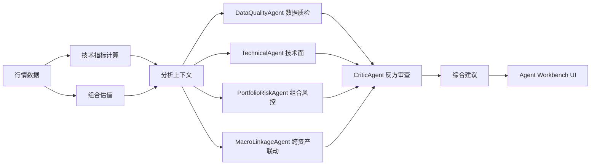

# MATLAB Agentic Research Dashboard

> 基于 MATLAB 的多资产智能投研看板，集行情监控、技术分析、组合风控、跨资产联动、压力测试与 Agent 集群投研建议于一体。

[](https://www.mathworks.com/products/matlab.html)
[](#核心特性)
[](#agent-工作流)
[](#测试状态)

**语言 / Language:** [中文 README](README.md) | [English README](README_EN.md)

---

## 关键词

`MATLAB` · `多资产投研` · `智能投研看板` · `Agent 集群` · `量化分析` · `金融科技` · `技术指标` · `组合风控` · `跨资产联动` · `加密资产分析` · `DeepSeek` · `投资研究工具`

## 适用场景

- MATLAB 课程设计、毕业设计或金融科技实验项目
- 多资产行情监控与投资研究原型开发
- 加密资产、ETF、黄金等跨资产联动分析
- 组合持仓风险、压力测试和仓位管理学习
- Agentic AI / Agent 集群在金融投研场景中的本地化实践
- DeepSeek 等大模型与 MATLAB 计算结果结合的应用示例

## 为什么选择这个项目

- **MATLAB 原生实现**：不依赖复杂 Web 前端，适合 MATLAB 课程和实验环境。
- **完整投研链路**：覆盖数据获取、指标计算、持仓管理、风险分析、Agent 建议和报告输出。
- **Agent 集群可解释**：不是黑盒聊天，而是由不同角色 Agent 分别给出依据和建议。
- **可测试工程结构**：使用 `matlab.unittest` 覆盖核心模块，方便继续扩展。
- **适合二次开发**：可以继续扩展股票、宏观、A 股、新闻、回测和独立 Agent 服务。

## 项目简介

`MATLAB Agentic Research Dashboard` 是一个基于 MATLAB 构建的多资产智能投研看板。项目使用 MATLAB 原生 UI、模块化 package 结构和本地 Agent 集群分析框架，实现从行情数据获取、技术指标计算、组合风险分析到投研建议生成的一整套流程。

本项目最初作为《MATLAB程序设计》课程设计项目开发，当前正在整理为可开源项目。它不是单纯的行情展示工具，而是希望把 MATLAB 的数值计算能力、可视化能力和 Agent 分工分析思想结合起来，形成一个可解释、可测试、可扩展的智能投研工作台。

## 核心特性

- **多资产行情看板**
  - 加密资产：`BTCUSDT`、`ETHUSDT`、`SOLUSDT`
  - 跨资产参考：`SPY`、`QQQ`、`GLD`
  - 现金资产：`USDT`

- **技术分析**
  - MA20 / MA50
  - MACD、Signal、Histogram
  - RSI14
  - 收益率、滚动波动率、异常收益检测

- **组合持仓管理**
  - 可编辑持仓表
  - 支持数量和成本价输入
  - 计算市值、未实现盈亏、配置比例
  - 支持 CSV / Excel 导入导出

- **风险与策略分析**
  - 组合风险贡献
  - 跨资产相关性
  - 多策略评分表
  - 压力测试情景

- **MATLAB 原生 Agent 集群**
  - `DataQualityAgent`：数据质检员
  - `TechnicalAgent`：技术面研究员
  - `PortfolioRiskAgent`：组合风控员
  - `MacroLinkageAgent`：跨资产联动研究员
  - `CriticAgent`：反方审查员
  - 输出综合建议：市场判断、仓位建议、可以加仓、需要减仓、重点观察

- **可选 LLM 报告**
  - 支持 DeepSeek API
  - 没有 API key 时自动回退到 MATLAB 本地规则分析

- **自动化测试**
  - 使用 MATLAB `matlab.unittest`
  - 覆盖技术指标、组合计算、分析上下文、Agent 输出、图表导航等核心模块

## 界面截图

截图暂未提交。开源前建议补充以下图片：

- 主界面截图
- Crypto Intraday 图表截图
- Cross-Asset Daily 图表截图
- Agent Workbench 综合建议截图
- 持仓与风险贡献截图
- MATLAB 单元测试通过截图

## 项目架构

```text
MATLAB Agentic Research Dashboard
│
├─ app/
│  └─ CryptoAssetDashboardApp.m        # 主 UI 应用
│
├─ +crypto/
│  ├─ +agents/                         # Agent 集群与投研建议
│  ├─ +analysis/                       # 分析上下文、风险、策略、LLM payload
│  ├─ +assets/                         # 资产池定义
│  ├─ +chart/                          # 图表窗口、缩放和平移辅助函数
│  ├─ +config/                         # 本地 API key 读取
│  ├─ +data/                           # 市场数据适配器和缓存
│  ├─ +export/                         # CSV / XLSX / 文本导入导出
│  ├─ +indicators/                     # MA、MACD、RSI、K 线增强
│  └─ +portfolio/                      # 持仓、盈亏、配置、风险说明
│
├─ tests/                              # MATLAB 单元测试
├─ docs/                               # 文档、课程报告、设计规格与计划
├─ runCryptoDashboard.m                # App 启动脚本
└─ diagnoseCryptoDashboard.m           # 数据与分析诊断脚本
```

## Agent 工作流

Agent 层不会替代 MATLAB 的计算逻辑，而是读取 MATLAB 已经计算好的结构化分析上下文，再转化为更适合用户阅读的投研判断。



综合建议重点回答：

- 当前市场怎么看？
- 当前仓位应该怎么处理？
- 什么情况下可以加仓？
- 什么情况下需要减仓？
- 后续重点观察什么？

## 环境要求

- MATLAB，需支持 App/UI 组件
- 可联网环境，用于获取实时行情
- 可选 API key：
  - `DEEPSEEK_API_KEY`
  - `FMP_API_KEY`
  - `ALPHAVANTAGE_API_KEY`

没有 LLM API key 时，核心 Agent 分析仍可运行。

## 快速开始

在 MATLAB 中进入项目根目录后运行：

```matlab
runCryptoDashboard
```

运行诊断脚本：

```matlab
diagnoseCryptoDashboard
```

运行全部测试：

```matlab
runtests("tests")
```

也可以在命令行运行：

```powershell
matlab -batch "runtests('tests')"
```

## API Key 配置

可以通过环境变量配置：

```matlab
setenv("DEEPSEEK_API_KEY", "your-key")
setenv("FMP_API_KEY", "your-key")
setenv("ALPHAVANTAGE_API_KEY", "your-key")
```

也可以在项目根目录创建本地配置文件 `config.local.json`：

```json
{
  "DEEPSEEK_API_KEY": "your-key",
  "FMP_API_KEY": "your-key",
  "ALPHAVANTAGE_API_KEY": "your-key"
}
```

`config.local.json` 已加入 `.gitignore`，不要提交 API key。

## 数据源

当前支持或预留的数据源：

- Binance Spot public market data：加密资产行情
- Stooq：跨资产日线数据
- FMP：可选备用数据源
- Alpha Vantage：可选备用数据源
- 本地缓存目录：`cache/`

更多说明见：[docs/data-sources.md](docs/data-sources.md)

## 测试状态

最近一次本地验证结果：

```text
41 Passed, 0 Failed, 0 Incomplete
```

测试覆盖：

- Agent 集群
- 分析上下文
- 资产池
- 图表导航
- 配置读取
- 跨资产面板
- 技术指标
- 组合计算

## 课程设计报告

课程设计报告见：

[docs/course-design-report.md](docs/course-design-report.md)

报告包含项目背景、总体设计、模块实现、测试结果、总结和主要代码，按《MATLAB程序设计》课程期末报告模板编写。

## 开源路线图

- 补充界面截图和演示 GIF
- 优化 Agent Workbench 视觉布局
- 增加历史投研报告归档
- 增加更多宏观资产和 A 股市场适配器
- 增加 Agent 建议的历史回测
- 增加可配置风险阈值
- 增加 Python / Node Agent 服务版本
- 打包 MATLAB App，降低使用门槛

## 免责声明

本项目用于课程设计、研究学习和软件工程实践，不构成投资建议，也不应作为自动交易系统使用。市场数据可能存在延迟、缺失或错误，所有分析结果仅供参考。

## License

本项目采用 MIT License，允许学习、修改、分发和二次开发。详见 [LICENSE](LICENSE)。
