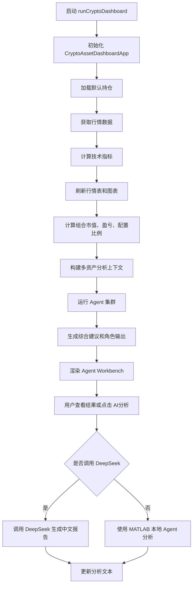
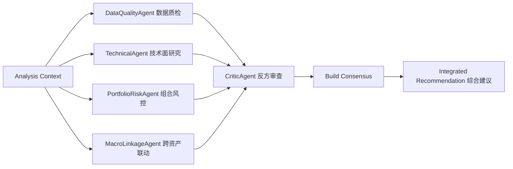
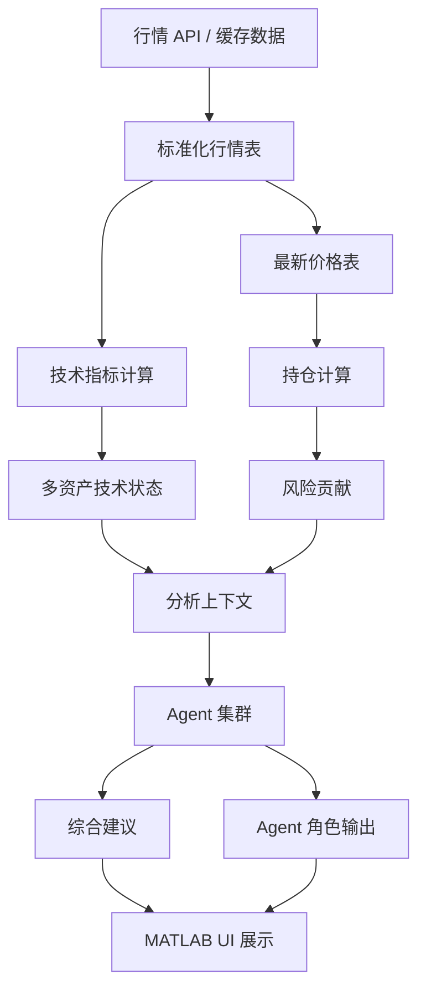
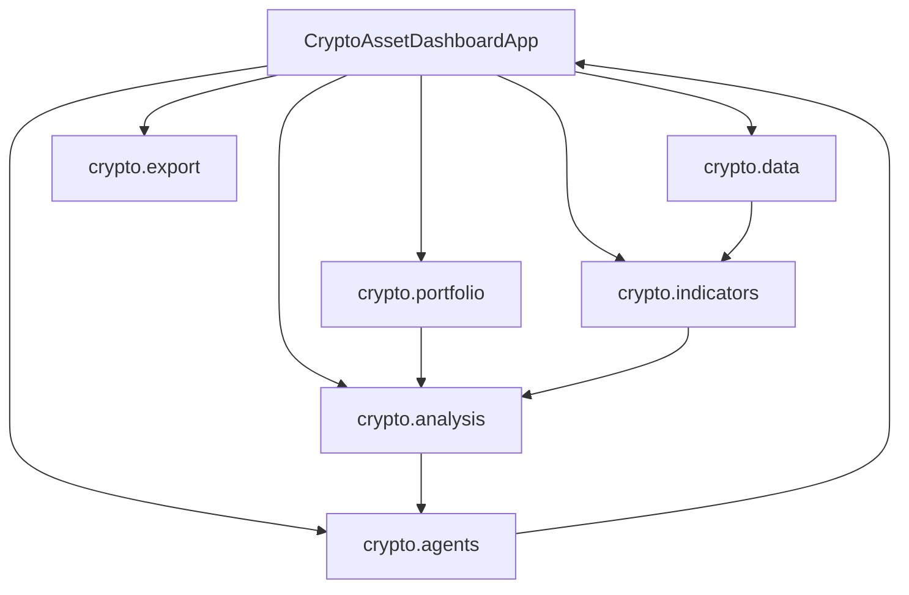

# 《MATLAB程序设计》课程期末报告

## 题目

**基于 MATLAB 与 Agent 集群的多资产智能投研看板设计与实现**

| 项目 | 内容 |
|---|---|
| 院（系） | 信息工程学院 |
| 专业班级 |  |
| 学号 |  |
| 组长/组员 |  |
| 项目分工 | 姓名：系统设计、MATLAB 程序开发、Agent 集群分析模块、测试与报告编写 |

---

## 目录

1. [项目背景与研究意义](#1-项目背景与研究意义)  
   1.1 [项目简介](#11-项目简介)  
   1.2 [项目的应用背景与现实意义](#12-项目的应用背景与现实意义)  
   1.3 [相关已有项目介绍](#13-相关已有项目介绍)  
   1.4 [项目目标与实现要求](#14-项目目标与实现要求)  
2. [项目设计思路与总体流程](#2-项目设计思路与总体流程)  
   2.1 [功能与性能需求分析](#21-功能与性能需求分析)  
   2.2 [总体设计思路概述](#22-总体设计思路概述)  
   2.3 [项目设计流程图](#23-项目设计流程图)  
   2.4 [模块划分与结构图](#24-模块划分与结构图)  
   2.5 [关键算法或技术路线说明](#25-关键算法或技术路线说明)  
3. [项目实现过程与功能模块](#3-项目实现过程与功能模块)  
   3.1 [主界面或主程序设计](#31-主界面或主程序设计)  
   3.2 [输入与预处理模块](#32-输入与预处理模块)  
   3.3 [核心功能模块设计与实现](#33-核心功能模块设计与实现)  
   3.4 [可视化与输出模块设计](#34-可视化与输出模块设计)  
   3.5 [模块间调用关系说明](#35-模块间调用关系说明)  
   3.6 [每个功能点的具体实现方法与关键代码说明](#36-每个功能点的具体实现方法与关键代码说明)  
4. [项目测试与结果分析](#4-项目测试与结果分析)  
   4.1 [测试环境与测试方法](#41-测试环境与测试方法)  
   4.2 [测试用例及输入数据说明](#42-测试用例及输入数据说明)  
   4.3 [测试结果展示](#43-测试结果展示)  
   4.4 [结果分析与评价](#44-结果分析与评价)  
   4.5 [存在的问题与优化建议](#45-存在的问题与优化建议)  
5. [项目总结](#5-项目总结)  
   5.1 [项目完成情况总结](#51-项目完成情况总结)  
   5.2 [项目中遇到的主要问题及解决方法](#52-项目中遇到的主要问题及解决方法)  
   5.3 [个人或团队收获与反思](#53-个人或团队收获与反思)  
6. [项目主要代码](#6-项目主要代码)

---

# 1. 项目背景与研究意义

## 1.1 项目简介

本课程设计项目名称为 **“基于 MATLAB 与 Agent 集群的多资产智能投研看板设计与实现”**。项目围绕数字资产、股票 ETF、商品资产等多资产市场数据，使用 MATLAB 构建一个集行情监控、技术指标计算、组合持仓管理、风险分析、跨资产联动分析、压力测试和 Agent 集群智能投研建议于一体的桌面应用看板。

项目主体采用 MATLAB 程序化 App 设计方式实现，入口文件为 `runCryptoDashboard.m`，主界面类为 `app/CryptoAssetDashboardApp.m`。系统通过多个 MATLAB package 模块组织代码，包括数据层、指标层、资产层、组合层、分析层、Agent 层和导出层。项目当前支持的主要资产包括：

- 加密资产：BTCUSDT、ETHUSDT、SOLUSDT
- 美股 ETF：SPY、QQQ
- 商品/避险资产：GLD
- 现金资产：USDT

系统不仅能够展示实时或缓存行情，还能够根据持仓数据计算市值、盈亏、资产配置比例、风险贡献，并进一步由 Agent 集群给出面向用户的投研建议，例如“市场判断”“仓位建议”“可以加仓”“需要减仓”“重点观察”等。

本项目的核心特点是：**不是只做一个普通行情图表工具，而是在 MATLAB 计算分析基础上加入 Agent 集群协作式投研逻辑**。每个 Agent 扮演不同投研角色，例如数据质检员、技术面研究员、组合风控员、跨资产联动研究员和反方审查员，最后由系统汇总形成综合建议。

## 1.2 项目的应用背景与现实意义

近年来，金融市场的数据量、资产种类和交易复杂度持续提升。个人投资者和研究人员面对的问题不再只是“某一个资产涨跌了多少”，而是需要综合判断：

- 当前资产处于什么趋势阶段；
- 加密资产与美股科技股是否存在共振；
- 黄金类资产是否具有避险作用；
- 当前持仓是否过于集中；
- 哪些资产可以继续观察，哪些资产需要降低风险；
- 市场波动下组合可能承受多大损失。

传统行情软件通常重在展示行情和图表，而不会清晰说明“基于这些数据应该如何理解市场”。同时，很多 AI 问答工具虽然可以生成文字报告，但缺少可验证的数据计算过程，容易产生空泛或缺乏依据的结论。

本项目结合 MATLAB 的数值计算能力和 Agent 分工分析思想，具有以下现实意义：

1. **提高数据分析效率**  
   系统能够自动获取市场行情、计算技术指标和风险指标，减少人工整理数据的工作量。

2. **增强组合风险意识**  
   通过市值、盈亏、配置比例和风险贡献计算，用户可以直观看到当前组合是否过度集中于某一资产。

3. **建立多资产联动视角**  
   系统不仅关注 BTC、ETH、SOL 等加密资产，也引入 SPY、QQQ、GLD 等跨资产指标，使分析不局限于单一市场。

4. **提升智能化投研表达能力**  
   Agent 集群将技术面、组合风险、跨资产联动和反方审查分开分析，再形成综合建议，使输出结果比单一文本报告更有层次。

5. **适合作为 MATLAB 综合课程设计项目**  
   项目使用了 MATLAB 表格处理、时间序列计算、GUI 界面、网络数据读取、文件导入导出、单元测试和结构化程序设计，覆盖 MATLAB 程序设计课程中的多个重要知识点。

## 1.3 相关已有项目介绍

与本项目功能相近的已有系统主要包括以下几类：

### 1. TradingView

TradingView 是常见的金融市场图表分析平台，支持 K 线图、技术指标、脚本策略和多市场行情展示。其优势是图表交互能力强、指标丰富、社区生态成熟。但 TradingView 更偏向通用图表平台，对个人持仓风险、跨资产组合风险贡献和 Agent 集群式解释支持较弱。

### 2. Wind / Bloomberg 等专业终端

Wind、Bloomberg 等金融终端面向专业机构，具备强大的数据源、宏观数据、资产分析、组合管理和研究报告功能。但这类系统成本高、功能复杂，不适合作为教学课程设计直接实现。

### 3. 聚宽、米筐等量化平台

量化平台通常提供数据接口、策略回测和因子研究工具，适合量化交易研究。它们偏向策略开发和回测环境，而本项目更偏向“多资产监控 + 持仓风险 + Agent 投研建议”的可视化看板。

### 4. 普通 AI 金融问答工具

普通 AI 问答工具可以基于用户输入生成市场分析文本，但如果没有结构化行情、持仓和风险数据作为输入，其结果可能缺少计算依据。本项目通过 MATLAB 先生成结构化上下文，再由 Agent 集群进行解释，降低了“无依据分析”的问题。

### 本项目的差异点

与上述工具相比，本项目的主要差异在于：

- 使用 MATLAB 独立实现主要计算逻辑；
- 同时包含行情、指标、持仓、风险、压力测试和 Agent 建议；
- Agent 输出不是后台日志，而是直接面向用户展示；
- 强调“可解释的投研建议”，而不是只展示指标数值。

> 截图说明：报告提交时可在此处补充项目运行界面截图，例如主界面、Agent Workbench 页面、持仓表、压力测试结果等。

## 1.4 项目目标与实现要求

本项目的总体目标是：**设计并实现一个基于 MATLAB 的多资产智能投研看板，使用户能够通过可视化界面完成行情查看、指标分析、持仓管理、风险评估和 Agent 集群投研判断。**

具体目标如下：

1. **行情数据获取**
   - 获取 BTCUSDT、ETHUSDT、SOLUSDT 等加密资产行情；
   - 支持 SPY、QQQ、GLD 等跨资产日线数据；
   - 支持缓存机制，减少重复请求。

2. **技术指标计算**
   - 计算 MA20、MA50；
   - 计算 MACD、MACD Signal、MACD Histogram；
   - 计算 RSI14；
   - 计算收益率、滚动波动率和异常收益。

3. **持仓与组合分析**
   - 支持用户录入持仓数量和成本；
   - 计算市值、成本、未实现盈亏、盈亏比例、配置比例；
   - 支持 CSV 导入导出持仓。

4. **多资产分析**
   - 建立多资产分析上下文；
   - 计算跨资产相关性；
   - 计算风险贡献；
   - 生成策略评分和风险提示。

5. **Agent 集群投研**
   - 构建多个本地 Agent；
   - 分角色输出观点；
   - 生成综合建议，包括市场判断、仓位建议、加仓/减仓方向和观察触发条件。

6. **可视化界面**
   - 使用 MATLAB `uifigure`、`uitable`、`uiaxes`、`uitextarea` 构建程序界面；
   - 展示行情表、K 线图、指标图、持仓表、Agent 输出、风险表和策略评分表。

7. **测试验证**
   - 使用 `matlab.unittest` 编写单元测试；
   - 覆盖技术指标、持仓计算、分析上下文、Agent 输出、图表窗口控制等模块；
   - 确保项目主要功能稳定运行。

# 2. 项目设计思路与总体流程

## 2.1 功能与性能需求分析

### 功能需求

根据项目目标，系统功能需求可以分为七类。

| 功能类别 | 需求说明 |
|---|---|
| 行情数据 | 获取加密资产行情和跨资产日线数据 |
| 技术指标 | 计算均线、MACD、RSI、收益率、波动率、异常收益 |
| 图表展示 | 展示 K 线图、均线、MACD、RSI 和跨资产日线图 |
| 持仓管理 | 支持录入、增删、导入、导出持仓 |
| 组合风险 | 计算市值、盈亏、配置比例、风险贡献和压力测试 |
| Agent 分析 | 多 Agent 分工分析并生成综合建议 |
| 测试验证 | 使用 MATLAB 单元测试保证主要函数正确 |

### 性能需求

本项目不是高频交易系统，因此性能需求主要体现为界面响应和计算稳定性：

1. **数据刷新时间可接受**  
   普通刷新应在可接受时间内完成，行情请求失败时不能导致程序崩溃。

2. **计算结果稳定**  
   对空表、缺失价格、缺失跨资产数据等情况要有容错处理。

3. **界面布局清晰**  
   主界面需要在一个窗口中同时展示行情、图表、持仓和 Agent 输出。

4. **Agent 输出可读**
   Agent 结果不能只展示内部字段或置信度，而应转化为用户能理解的投研建议。

5. **测试可重复**
   核心计算模块应使用确定性输入进行测试，不依赖实时网络数据。

## 2.2 总体设计思路概述

系统采用“分层模块化”的设计思路。最底层负责数据获取和指标计算，中间层负责组合与分析上下文构建，上层负责 Agent 集群分析和可视化展示。

总体设计可概括为：

1. 数据层从外部数据源获取行情；
2. 指标层对行情数据进行技术指标计算；
3. 组合层根据用户持仓计算市值、盈亏和配置比例；
4. 分析层构建多资产上下文，包括技术状态、相关性和风险贡献；
5. Agent 层基于上下文进行分角色分析；
6. UI 层将图表、表格和文本建议展示给用户。

这种设计方式的优点是模块边界清晰。数据获取、指标计算、持仓计算、Agent 分析和界面展示互相解耦，便于后续维护和扩展。

## 2.3 项目设计流程图

### 程序总体流程图



### Agent 集群分析流程图



### 数据流图



## 2.4 模块划分与结构图

项目主要文件结构如下：

```text
5_17
├─ app
│  └─ CryptoAssetDashboardApp.m
├─ +crypto
│  ├─ +agents
│  ├─ +analysis
│  ├─ +assets
│  ├─ +chart
│  ├─ +config
│  ├─ +data
│  ├─ +export
│  ├─ +indicators
│  └─ +portfolio
├─ tests
│  ├─ TestAgents.m
│  ├─ TestAnalysis.m
│  ├─ TestAssets.m
│  ├─ TestChartNavigation.m
│  ├─ TestConfig.m
│  ├─ TestCrossAssetPanel.m
│  ├─ TestIndicators.m
│  └─ TestPortfolio.m
├─ docs
│  └─ data-sources.md
├─ runCryptoDashboard.m
└─ diagnoseCryptoDashboard.m
```

### 模块结构说明

| 模块 | 主要文件 | 功能 |
|---|---|---|
| 主界面模块 | `app/CryptoAssetDashboardApp.m` | 构建 UI、刷新数据、渲染图表和 Agent 输出 |
| 启动模块 | `runCryptoDashboard.m` | 添加 app 路径并启动程序 |
| 数据模块 | `+crypto/+data` | 行情获取、缓存、数据标准化 |
| 指标模块 | `+crypto/+indicators` | MA、MACD、RSI、收益率、波动率计算 |
| 持仓模块 | `+crypto/+portfolio` | 持仓读写、市值、盈亏、配置比例计算 |
| 分析模块 | `+crypto/+analysis` | 分析上下文、风险贡献、策略评分、DeepSeek 调用 |
| Agent 模块 | `+crypto/+agents` | 多 Agent 分析、综合建议、角色输出 |
| 图表模块 | `+crypto/+chart` | 图表窗口、缩放、平移辅助计算 |
| 测试模块 | `tests` | 单元测试与功能验证 |

## 2.5 关键算法或技术路线说明

### 1. 技术指标计算

系统使用收盘价序列计算移动平均线、MACD 和 RSI。

- **MA20 / MA50**：反映中短期趋势；
- **MACD**：衡量趋势动量；
- **RSI14**：判断超买、超卖或中性区间；
- **Return**：计算相邻 K 线收益率；
- **RollingVolatility**：衡量最近窗口的波动水平；
- **ReturnZScore**：识别异常收益。

### 2. 组合持仓计算

持仓计算主要根据用户输入的数量和成本价，结合当前价格计算：

```text
MarketValue = Quantity × LastPrice
CostValue = Quantity × CostBasis
UnrealizedPnL = MarketValue - CostValue
UnrealizedPnLPercent = UnrealizedPnL / CostValue × 100%
Allocation = MarketValue / TotalMarketValue
```

### 3. 风险贡献计算

在分析上下文中，系统根据资产配置比例和波动率估算风险分数：

```text
RiskScore = Allocation × Volatility20
RiskContribution = RiskScore / sum(RiskScore)
```

风险贡献越高，说明该资产对组合波动的影响越大。

### 4. 跨资产相关性分析

系统将多个资产的收益率对齐，使用相关系数矩阵衡量资产之间的联动程度。若平均相关性较高，则说明资产之间可能同时上涨或同时下跌，组合分散化效果下降。

### 5. Agent 集群分析

Agent 模块采用本地规则分析，不依赖大模型即可运行。其技术路线是：

1. 构建结构化分析上下文；
2. 多个 Agent 分别读取上下文；
3. 每个 Agent 输出自己的观察、风险和建议；
4. CriticAgent 对前序 Agent 进行反方审查；
5. 系统汇总形成综合建议。

Agent 的分工如下：

| Agent | 人设 | 分析重点 |
|---|---|---|
| DataQualityAgent | 数据质检员 | 数据是否完整、是否足够支撑结论 |
| TechnicalAgent | 技术面研究员 | 趋势、强弱、动量、波动 |
| PortfolioRiskAgent | 组合风控员 | 集中度、风险贡献、仓位控制 |
| MacroLinkageAgent | 跨资产联动研究员 | 加密资产、美股、黄金之间的关系 |
| CriticAgent | 反方审查员 | 检查过度乐观、证据不足和结论冲突 |

# 3. 项目实现过程与功能模块

## 3.1 主界面或主程序设计

项目主程序入口为 `runCryptoDashboard.m`。该脚本主要完成以下工作：

1. 获取当前项目下的 `app` 文件夹路径；
2. 将 `app` 文件夹加入 MATLAB 搜索路径；
3. 清除旧的 App 类定义；
4. 创建 `CryptoAssetDashboardApp` 对象并启动界面。

主界面由 `CryptoAssetDashboardApp` 类实现。界面主要包含：

- 顶部控制区：资产选择、周期选择、刷新按钮、自动刷新、AI 分析按钮；
- 左侧区域：行情表和持仓录入表；
- 中间区域：图表 Tab，包括 Crypto Intraday、Cross-Asset Daily、AI 分析；
- 右侧区域：组合摘要、资产配置图、组合明细表；
- 底部说明区：提示用户如何阅读 Agent Workbench。

AI 分析页面经过重点设计，包含：

- 持仓影响说明；
- 市场联动说明；
- 综合建议；
- Agent 集群输出；
- 压力测试；
- 策略评分；
- 本地分析/DeepSeek 报告；
- 风险贡献表。

## 3.2 输入与预处理模块

系统输入主要包括三类：

1. **行情数据输入**
   - 来自 Binance、Stooq、FMP、Alpha Vantage 等数据源；
   - 加密资产主要使用 Binance；
   - 跨资产数据可使用 Stooq 或其他外部源。

2. **持仓数据输入**
   - 默认持仓由 `crypto.portfolio.defaultPositions()` 生成；
   - 用户可在 UI 表格中编辑 `Qty` 和 `Cost`；
   - 支持 CSV / Excel 文件导入。

3. **配置数据输入**
   - API key 可通过环境变量或 `config.local.json` 设置；
   - 例如 DeepSeek、FMP、Alpha Vantage 等。

预处理主要包括：

- 将行情响应标准化为 MATLAB table；
- 将 K 线数据转换为包含时间、开高低收、成交量的表；
- 对 K 线数据添加技术指标列；
- 对持仓表进行字段标准化，确保包含 `Symbol`、`AssetClass`、`Quantity`、`CostBasis`。

## 3.3 核心功能模块设计与实现

### 3.3.1 行情数据模块

数据模块位于 `+crypto/+data`，主要负责：

- 获取 24 小时行情；
- 获取 K 线数据；
- 获取跨资产日线数据；
- 读取和写入缓存；
- 根据资产类型选择数据源。

其中 `latestPrices.m` 用于统一获取当前资产池的最新价格。系统会将 USDT 作为现金资产处理，其价格固定为 1。

### 3.3.2 技术指标模块

指标模块位于 `+crypto/+indicators`。核心函数包括：

- `movingAverage.m`
- `macd.m`
- `rsi.m`
- `enrichCandles.m`

`enrichCandles` 是指标整合函数，会在原始 K 线表中追加 MA、MACD、RSI、收益率、滚动波动率和异常收益列。

### 3.3.3 持仓管理模块

持仓模块位于 `+crypto/+portfolio`。主要函数包括：

- `defaultPositions.m`：生成默认演示持仓；
- `calculateHoldings.m`：计算市值、盈亏和配置比例；
- `summarizePortfolio.m`：汇总组合总值、总盈亏、最大持仓等；
- `riskNarrative.m`：生成组合风险文字说明；
- `appendPosition.m`、`removePosition.m`：支持增删持仓；
- `readPositions.m`、`writePositions.m`：支持导入导出。

### 3.3.4 分析上下文模块

分析模块位于 `+crypto/+analysis`。其中 `buildContext.m` 是核心函数，它将行情、K 线、持仓整合为结构化上下文。

上下文包括：

- `MarketSnapshot`：市场快照；
- `TechnicalState`：技术状态；
- `Portfolio`：组合持仓；
- `Correlation`：相关性矩阵；
- `RiskContributions`：风险贡献；
- `StrategyScores`：策略评分；
- `Signals`：风险/机会信号；
- `LLMPayload`：可发送给 LLM 的结构化数据。

### 3.3.5 Agent 集群模块

Agent 模块位于 `+crypto/+agents`，是本项目的创新重点。

主要文件如下：

| 文件 | 功能 |
|---|---|
| `runResearchAgents.m` | Agent 编排入口 |
| `dataQualityAgent.m` | 数据质检 Agent |
| `technicalAgent.m` | 技术面 Agent |
| `portfolioRiskAgent.m` | 组合风险 Agent |
| `macroLinkageAgent.m` | 跨资产联动 Agent |
| `criticAgent.m` | 反方审查 Agent |
| `buildConsensus.m` | 汇总共识、分歧、观察项 |
| `formatIntegratedRecommendation.m` | 生成综合建议 |
| `formatCards.m` | 生成人设化 Agent 输出 |

Agent 输出不是简单的内部字段，而是被转换成面向用户的投研语言。例如：

- 市场判断：短期趋势是否偏强、偏弱或分化；
- 仓位建议：持有、降低风险、等待回撤；
- 可以加仓：什么情况下可以加，优先观察哪些资产；
- 需要减仓：哪些风险情况下需要减仓；
- 重点观察：均线、风险贡献、跨资产共振、黄金避险等。

### 3.3.6 DeepSeek 分析模块

系统支持 DeepSeek API 分析。DeepSeek 并不是系统运行的必要条件，当 API key 缺失时，系统会回退到本地规则分析。

该设计的优点是：

- 没有 API key 时仍可运行；
- 有 API key 时可生成更自然的中文报告；
- MATLAB 计算结果仍然是分析依据，避免完全依赖大模型。

## 3.4 可视化与输出模块设计

系统可视化主要包括以下内容：

1. **行情表**
   - 展示 Symbol、Last、24h%、Volume、High、Low。

2. **K 线图**
   - 展示价格走势和 MA20；
   - 支持窗口选择、历史滚动、最新视图。

3. **指标图**
   - 展示 MACD、MACD Signal、MACD Histogram 和 RSI。

4. **跨资产日线图**
   - 展示 SPY、QQQ、GLD 等跨资产走势；
   - 用于判断风险资产和避险资产关系。

5. **组合配置图**
   - 通过饼图或配置图展示资产占比。

6. **Agent Workbench**
   - 综合建议；
   - Agent 分角色输出；
   - 本地分析和 DeepSeek 报告；
   - 策略评分表；
   - 风险贡献表；
   - 压力测试结果。

7. **导出功能**
   - 支持导出行情表、分析摘要、持仓表等。

## 3.5 模块间调用关系说明

模块调用关系如下：



具体调用过程如下：

1. `refreshData` 调用 `crypto.data.latestPrices` 获取最新行情；
2. 调用 `crypto.data.fetchCandles` 获取 K 线；
3. 调用 `crypto.indicators.enrichCandles` 计算技术指标；
4. 调用 `updatePortfolio` 计算持仓表现；
5. 调用 `crypto.analysis.buildContext` 构建分析上下文；
6. 调用 `crypto.agents.runResearchAgents` 运行 Agent 集群；
7. 调用 `renderAgentWorkbench` 渲染综合建议和 Agent 输出。

## 3.6 每个功能点的具体实现方法与关键代码说明

### 功能点 1：启动 App

通过 `runCryptoDashboard.m` 启动程序，保证 App 类路径正确。

```matlab
function app = runCryptoDashboard()
%RUNCRYPTODASHBOARD Launch the AI crypto asset dashboard.
    appDir = fullfile(fileparts(mfilename("fullpath")), "app");
    if contains(path, appDir)
        rmpath(appDir);
    end
    addpath(appDir, "-begin");
    rehash;
    clear("CryptoAssetDashboardApp");
    app = CryptoAssetDashboardApp();
end
```

### 功能点 2：技术指标增强

`enrichCandles` 将原始 K 线表增强为技术分析表。

```matlab
function candles = enrichCandles(candles)
    required = ["OpenTime", "Open", "High", "Low", "Close", "Volume"];
    missing = setdiff(required, string(candles.Properties.VariableNames));
    if ~isempty(missing)
        error("crypto:indicators:MissingColumns", ...
            "Candle table is missing: %s", strjoin(missing, ", "));
    end

    closePrices = candles.Close;
    candles.MA20 = crypto.indicators.movingAverage(closePrices, 20);
    candles.MA50 = crypto.indicators.movingAverage(closePrices, 50);
    [candles.MACD, candles.MACDSignal, candles.MACDHistogram] = ...
        crypto.indicators.macd(closePrices, 12, 26, 9);
    candles.RSI14 = crypto.indicators.rsi(closePrices, 14);
    candles.Return = [NaN; diff(closePrices) ./ closePrices(1:end-1)];
end
```

### 功能点 3：持仓计算

持仓计算函数根据数量、成本价和最新价格计算组合表现。

```matlab
result.MarketValue = result.Quantity .* result.LastPrice;
result.CostValue = result.Quantity .* result.CostBasis;
result.UnrealizedPnL = result.MarketValue - result.CostValue;
result.UnrealizedPnLPercent = result.UnrealizedPnL ./ result.CostValue * 100;

totalValue = sum(result.MarketValue, "omitnan");
if totalValue > 0
    result.Allocation = result.MarketValue ./ totalValue;
end
```

### 功能点 4：构建分析上下文

分析上下文将多个模块的结果整合到一个结构体中，供本地分析、Agent 和 DeepSeek 使用。

```matlab
context = struct();
context.Version = "ai-analysis-context-v1";
context.GeneratedAt = datetime("now", "TimeZone", "Asia/Shanghai");
context.Universe = symbols;
context.MarketSnapshot = marketSnapshot;
context.TechnicalState = technicalState;
context.Portfolio = portfolio;
context.Correlation = correlation;
context.RiskContributions = riskContributions;
context.StrategyScores = strategyScores;
context.Signals = signals;
context.LLMPayload = localPayload(context);
```

### 功能点 5：运行 Agent 集群

Agent 编排器依次运行多个 Agent，并生成综合建议。

```matlab
function run = runResearchAgents(context)
    startedAt = datetime("now", "TimeZone", "Asia/Shanghai");
    dataQuality = crypto.agents.dataQualityAgent(context);
    technical = crypto.agents.technicalAgent(context);
    portfolioRisk = crypto.agents.portfolioRiskAgent(context);
    macroLinkage = crypto.agents.macroLinkageAgent(context);
    previous = [dataQuality, technical, portfolioRisk, macroLinkage];
    critic = crypto.agents.criticAgent(context, previous);
    agentResults = [previous, critic];

    [consensus, disagreements, watchlist, evidenceLog] = ...
        crypto.agents.buildConsensus(agentResults);

    run = struct();
    run.RunId = "agent-run-" + string(datetime(startedAt, "Format", "yyyyMMdd-HHmmss"));
    run.AgentResults = agentResults;
    run.Consensus = consensus(:);
    run.Disagreements = disagreements(:);
    run.ActionWatchlist = watchlist(:);
    run.EvidenceLog = evidenceLog(:);
    run.IntegratedRecommendation = crypto.agents.formatIntegratedRecommendation(run);
end
```

### 功能点 6：综合建议输出

综合建议不是简单输出置信度，而是面向用户说明操作含义。

```matlab
lines = [
    "综合建议";
    "市场判断: " + marketView;
    "仓位建议: " + positionView;
    "可以加仓: " + addView;
    "需要减仓: " + reduceView;
    "重点观察: " + watchView;
    "执行提醒: 这不是自动交易信号，先按观察条件确认，再分批调整仓位。"
];
```

### 功能点 7：Agent Workbench 渲染

主界面通过 `renderAgentWorkbench` 将 Agent 结果展示到 UI 中。

```matlab
function renderAgentWorkbench(app)
    if isempty(app.AgentCardsTextArea) || isempty(app.IntegratedRecommendationTextArea)
        return
    end
    if isempty(fieldnames(app.LatestAgentRun))
        app.AgentCardsTextArea.Value = app.textAreaValue("Agent 集群输出：等待分析。");
        app.IntegratedRecommendationTextArea.Value = ...
            app.textAreaValue("综合建议：等待 Agent 集群完成分析。");
        return
    end
    app.AgentCardsTextArea.Value = ...
        app.textAreaValue(crypto.agents.formatCards(app.LatestAgentRun));
    app.IntegratedRecommendationTextArea.Value = ...
        app.textAreaValue(app.LatestAgentRun.IntegratedRecommendation);
end
```

# 4. 项目测试与结果分析

## 4.1 测试环境与测试方法

### 测试环境

| 项目 | 内容 |
|---|---|
| 操作系统 | Windows |
| 开发环境 | MATLAB |
| 项目路径 | `D:\Code\MATLAB\5_17` |
| 测试框架 | `matlab.unittest` |
| 主要数据源 | Binance、Stooq、FMP、Alpha Vantage、DeepSeek |
| 主要语言 | MATLAB |

### 测试方法

项目采用自动化单元测试与诊断脚本结合的方式进行验证。

1. **单元测试**
   使用 `runtests("tests")` 运行全部测试文件，验证指标、组合、分析、Agent、图表窗口等模块。

2. **诊断测试**
   使用 `diagnoseCryptoDashboard` 验证行情获取、K 线获取、指标计算、分析输出和 AI 分析链路。

3. **人工界面检查**
   启动 `runCryptoDashboard` 后查看主界面布局、Agent Workbench 输出、持仓表和图表显示。

## 4.2 测试用例及输入数据说明

### 测试文件

| 测试文件 | 测试内容 |
|---|---|
| `TestIndicators.m` | MA、MACD、RSI、K 线增强 |
| `TestPortfolio.m` | 持仓计算、现金价格、组合汇总、导入导出 |
| `TestAnalysis.m` | 分析上下文、本地分析、DeepSeek 消息、压力测试 |
| `TestAgents.m` | Agent 编排、综合建议、角色输出 |
| `TestAssets.m` | 资产池和资产分类 |
| `TestChartNavigation.m` | 图表窗口缩放和平移 |
| `TestConfig.m` | 配置读取 |
| `TestCrossAssetPanel.m` | 跨资产面板资产列表 |

### 输入数据示例

测试中构造了确定性行情和持仓数据，例如：

```matlab
symbols = ["BTCUSDT", "ETHUSDT", "SOLUSDT", "SPY", "QQQ", "GLD"];
tickers = table(symbols', [70000; 3000; 180; 520; 440; 210], ...
    [3.2; 2.1; 5.8; 0.6; 0.9; -0.2], ...
    'VariableNames', {'Symbol', 'LastPrice', 'PriceChangePercent'});
```

持仓示例：

```matlab
portfolio = table(["BTCUSDT"; "ETHUSDT"; "SOLUSDT"; "SPY"; "QQQ"; "GLD"], ...
    ["Crypto"; "Crypto"; "Crypto"; "US Equity"; "US Equity"; "Commodity"], ...
    [0.8; 1; 5; 2; 1; 1], [60000; 2500; 150; 500; 420; 200], ...
    'VariableNames', {'Symbol', 'AssetClass', 'Quantity', 'CostBasis'});
```

## 4.3 测试结果展示

运行命令：

```matlab
matlab -batch "runtests('tests')"
```

测试结果：

```text
总计:
   41 Passed, 0 Failed, 0 Incomplete.
   8.5878 秒测试时间。
```

诊断脚本运行命令：

```matlab
matlab -batch "diagnoseCryptoDashboard"
```

诊断输出包含：

- 成功读取默认资产：BTCUSDT、ETHUSDT、SOLUSDT；
- 成功获取 24h tickers；
- 成功获取 BTCUSDT 1h candles；
- 成功计算 MA20、MACDHistogram、RSI14；
- 成功生成分析文本；
- DeepSeek provider 状态为 `deepseek`，adapter status 为 `ok`；
- 输出 `Diagnosis finished.`

> 截图建议：  
> 可在最终提交时补充以下截图：  
> 1. 主界面截图；  
> 2. Crypto Intraday 图表截图；  
> 3. Agent Workbench 综合建议截图；  
> 4. 持仓表和风险贡献表截图；  
> 5. MATLAB 测试通过截图。

## 4.4 结果分析与评价

从测试结果看，项目主要模块均能够正常运行，41 个测试全部通过，说明核心函数具有较好的稳定性。

### 功能完成度评价

| 功能 | 完成情况 | 评价 |
|---|---|---|
| 行情获取 | 已完成 | 支持加密资产和跨资产数据 |
| 技术指标 | 已完成 | MA、MACD、RSI、收益率、异常收益均已实现 |
| 持仓管理 | 已完成 | 支持录入、增删、导入导出 |
| 组合分析 | 已完成 | 可计算市值、盈亏、配置和风险贡献 |
| Agent 集群 | 已完成 | 具备 5 个角色 Agent 和综合建议 |
| 压力测试 | 已完成 | 支持多类冲击情景 |
| DeepSeek 分析 | 已完成 | 支持 API 调用和缺 key 回退 |
| 测试体系 | 已完成 | 41 个自动化测试通过 |

### 输出效果评价

项目初期的 AI 输出偏向技术字段，例如置信度、Evidence、Recommendation 等，不够适合普通用户阅读。后续对 Agent 输出进行了优化，使其转换为更清晰的投研语言：

- “市场判断”说明当前市场趋势；
- “仓位建议”说明如何处理持仓；
- “可以加仓”说明加仓条件；
- “需要减仓”说明减仓条件；
- “重点观察”说明后续应关注的触发条件。

这种输出方式更符合投研看板的实际使用场景。

## 4.5 存在的问题与优化建议

### 存在的问题

1. **数据源稳定性受网络影响**
   外部行情 API 可能因网络、限流或服务异常导致数据获取失败。

2. **Agent 规则仍偏本地规则**
   当前 Agent 主要基于确定性规则，不具备长期记忆、新闻理解和复杂推理能力。

3. **图形界面美观度仍可提升**
   MATLAB 原生 UI 能满足功能需求，但卡片式展示、颜色层级和交互细节还可以继续优化。

4. **投资建议仍需谨慎解释**
   系统输出为辅助分析，不应被理解为自动交易指令。

5. **中文编码需要统一管理**
   项目中包含较多中文 UI 文案，应保持 UTF-8 编码，避免终端或编辑器导致乱码。

### 优化建议

1. 增加更多资产类别，例如美元指数、利率、A 股指数等；
2. 增加新闻/宏观事件 Agent；
3. 增加历史报告归档功能；
4. 增加回测模块，验证 Agent 建议在历史数据中的表现；
5. 将 Agent 集群升级为独立服务，实现异步分析和长期记忆；
6. 优化 UI 视觉效果，将 Agent 输出改为真正的卡片式组件；
7. 增加用户自定义策略和自定义风险阈值。

# 5. 项目总结

## 5.1 项目完成情况总结

本项目完成了一个基于 MATLAB 的多资产智能投研看板。系统实现了行情获取、技术指标计算、组合持仓管理、风险贡献分析、跨资产相关性分析、压力测试、DeepSeek 报告和 Agent 集群综合建议等功能。

项目最终形成了较完整的模块结构：

- 数据层负责行情获取；
- 指标层负责技术指标计算；
- 持仓层负责组合计算；
- 分析层负责结构化上下文；
- Agent 层负责智能投研建议；
- UI 层负责可视化展示；
- 测试层负责自动化验证。

项目测试结果为：

```text
41 Passed, 0 Failed, 0 Incomplete
```

说明项目主要功能已经实现并通过自动化验证。

## 5.2 项目中遇到的主要问题及解决方法

### 问题 1：如何组织较复杂的 MATLAB 项目结构

项目涉及数据、指标、组合、分析、Agent、UI 等多个模块。如果全部写在一个文件中，会导致代码难以维护。

**解决方法：**  
采用 MATLAB package 结构，将代码拆分到 `+crypto/+data`、`+crypto/+indicators`、`+crypto/+portfolio`、`+crypto/+analysis`、`+crypto/+agents` 等目录中。

### 问题 2：外部数据源可能不可用

行情数据依赖外部 API，网络或接口异常会影响程序运行。

**解决方法：**  
系统加入缓存机制，并在部分模块中加入异常捕获。跨资产数据无法获取时，系统仍可使用已加载资产继续分析。

### 问题 3：AI 输出一开始不够面向用户

早期 Agent 输出偏向工程字段，如置信度、Evidence、Recommendation，用户不容易理解。

**解决方法：**  
重新设计展示层，将 Agent 输出改为“投研角色语言”，并增加综合建议区域，明确给出市场判断、仓位建议、加仓/减仓方向和观察条件。

### 问题 4：中文编码问题

在 Windows PowerShell 和 MATLAB 文件之间处理中文时，曾出现中文显示乱码的问题。

**解决方法：**  
减少通过命令行整体重写含中文文件的操作，尽量使用小范围补丁，并保持文件编码一致。

### 问题 5：如何验证 Agent 结果不是随意文本

Agent 输出属于文本型结果，如果没有测试约束，后续修改容易退化成不可读的内部日志。

**解决方法：**  
增加 `TestAgents.m`，验证综合建议必须包含“市场判断”“仓位建议”“可以加仓”“需要减仓”“重点观察”等用户关心的内容，同时验证 Agent 卡片使用“技术面研究员”“组合风控员”等角色化表达。

## 5.3 个人或团队收获与反思

通过本项目，主要收获如下：

1. **掌握了 MATLAB GUI 程序设计方法**  
   使用 `uifigure`、`uigridlayout`、`uitable`、`uiaxes`、`uitextarea` 构建了较复杂的桌面应用。

2. **提升了 MATLAB 数据处理能力**  
   项目中大量使用 table、datetime、矩阵计算和时间序列处理，对 MATLAB 数据结构有了更深入理解。

3. **理解了金融指标和组合风险的基本计算方法**  
   包括均线、MACD、RSI、收益率、波动率、风险贡献和压力测试等。

4. **学习了模块化工程设计思想**  
   将复杂项目拆分为多个 package，使代码结构更清晰、可维护性更强。

5. **认识到 AI 输出必须面向用户场景**
   智能分析不是简单输出技术字段，而应转化为用户能够理解和执行的建议。

6. **掌握了测试驱动开发思想**
   通过 `matlab.unittest` 对核心函数进行验证，提高了程序可靠性。

反思方面，本项目仍有进一步提升空间。例如，当前 Agent 主要使用本地规则，未来可以结合更多外部数据、历史回测和大模型工具调用，使 Agent 更接近真实投研团队的工作方式。

# 6. 项目主要代码

本节列出项目中具有代表性的主要代码。完整代码位于项目目录中的 `app`、`+crypto` 和 `tests` 文件夹。

## 6.1 启动程序 `runCryptoDashboard.m`

```matlab
function app = runCryptoDashboard()
%RUNCRYPTODASHBOARD Launch the AI crypto asset dashboard.
    appDir = fullfile(fileparts(mfilename("fullpath")), "app");
    if contains(path, appDir)
        rmpath(appDir);
    end
    addpath(appDir, "-begin");
    rehash;
    clear("CryptoAssetDashboardApp");
    app = CryptoAssetDashboardApp();
end
```

## 6.2 技术指标增强 `enrichCandles.m`

```matlab
function candles = enrichCandles(candles)
%ENRICHCANDLES Add standard technical indicator columns to a candle table.
    required = ["OpenTime", "Open", "High", "Low", "Close", "Volume"];
    missing = setdiff(required, string(candles.Properties.VariableNames));
    if ~isempty(missing)
        error("crypto:indicators:MissingColumns", ...
            "Candle table is missing: %s", strjoin(missing, ", "));
    end

    closePrices = candles.Close;
    candles.MA20 = crypto.indicators.movingAverage(closePrices, 20);
    candles.MA50 = crypto.indicators.movingAverage(closePrices, 50);
    [candles.MACD, candles.MACDSignal, candles.MACDHistogram] = ...
        crypto.indicators.macd(closePrices, 12, 26, 9);
    candles.RSI14 = crypto.indicators.rsi(closePrices, 14);
    candles.Return = [NaN; diff(closePrices) ./ closePrices(1:end-1)];

    rollingVol = NaN(height(candles), 1);
    lookback = 20;
    for idx = lookback:height(candles)
        rollingVol(idx) = std(candles.Return(idx - lookback + 1:idx), "omitnan") * sqrt(lookback);
    end
    candles.RollingVolatility = rollingVol;

    retMean = mean(candles.Return, "omitnan");
    retStd = std(candles.Return, "omitnan");
    if isnan(retStd) || retStd == 0
        candles.ReturnZScore = NaN(height(candles), 1);
        candles.IsReturnAnomaly = false(height(candles), 1);
    else
        candles.ReturnZScore = (candles.Return - retMean) ./ retStd;
        candles.IsReturnAnomaly = abs(candles.ReturnZScore) >= 2.5;
    end
end
```

## 6.3 持仓计算 `calculateHoldings.m`

```matlab
function result = calculateHoldings(holdings, prices)
%CALCULATEHOLDINGS Compute current value, PnL, and allocation for holdings.
    arguments
        holdings table
        prices table
    end

    result = holdings;
    if ~ismember("AssetClass", string(result.Properties.VariableNames))
        result.AssetClass = repmat("Unknown", height(result), 1);
    end
    result.LastPrice = zeros(height(result), 1);
    result.MarketValue = zeros(height(result), 1);
    result.CostValue = zeros(height(result), 1);
    result.UnrealizedPnL = zeros(height(result), 1);
    result.UnrealizedPnLPercent = zeros(height(result), 1);
    result.Allocation = zeros(height(result), 1);

    if height(result) == 0
        return
    end

    for idx = 1:height(result)
        match = strcmp(string(prices.Symbol), string(result.Symbol(idx)));
        if any(match)
            result.LastPrice(idx) = prices.LastPrice(find(match, 1, "first"));
        else
            result.LastPrice(idx) = NaN;
        end
    end

    result.MarketValue = result.Quantity .* result.LastPrice;
    result.CostValue = result.Quantity .* result.CostBasis;
    result.UnrealizedPnL = result.MarketValue - result.CostValue;
    result.UnrealizedPnLPercent = result.UnrealizedPnL ./ result.CostValue * 100;
    result.UnrealizedPnLPercent(result.CostValue == 0) = 0;

    totalValue = sum(result.MarketValue, "omitnan");
    if totalValue > 0
        result.Allocation = result.MarketValue ./ totalValue;
    end
end
```

## 6.4 构建分析上下文 `buildContext.m`

```matlab
function context = buildContext(tickers, candlesBySymbol, portfolio)
%BUILDCONTEXT Build structured multi-asset AI analysis context.
    arguments
        tickers table
        candlesBySymbol struct
        portfolio table = table()
    end

    targetSymbols = ["BTCUSDT"; "ETHUSDT"; "SOLUSDT"; "SPY"; "QQQ"; "GLD"];
    symbols = localAvailableSymbols(targetSymbols, candlesBySymbol);
    marketSnapshot = localMarketSnapshot(tickers, symbols);
    technicalState = localTechnicalState(candlesBySymbol, symbols);
    [returnMatrix, returnSymbols] = localReturnMatrix(candlesBySymbol, symbols);
    correlation = localCorrelation(returnMatrix, returnSymbols);
    riskContributions = localRiskContributions(portfolio, technicalState);
    signals = localSignals(riskContributions, technicalState, correlation);

    context = struct();
    context.Version = "ai-analysis-context-v1";
    context.GeneratedAt = datetime("now", "TimeZone", "Asia/Shanghai");
    context.Universe = symbols;
    context.MarketSnapshot = marketSnapshot;
    context.TechnicalState = technicalState;
    context.Portfolio = portfolio;
    context.Correlation = correlation;
    context.RiskContributions = riskContributions;
    context.Signals = signals;
end
```

## 6.5 Agent 编排器 `runResearchAgents.m`

```matlab
function run = runResearchAgents(context)
%RUNRESEARCHAGENTS Run the MATLAB-native research Agent cluster.
    arguments
        context struct
    end

    startedAt = datetime("now", "TimeZone", "Asia/Shanghai");
    dataQuality = crypto.agents.dataQualityAgent(context);
    technical = crypto.agents.technicalAgent(context);
    portfolioRisk = crypto.agents.portfolioRiskAgent(context);
    macroLinkage = crypto.agents.macroLinkageAgent(context);
    previous = [dataQuality, technical, portfolioRisk, macroLinkage];
    critic = crypto.agents.criticAgent(context, previous);
    agentResults = [previous, critic];
    [consensus, disagreements, watchlist, evidenceLog] = ...
        crypto.agents.buildConsensus(agentResults);

    run = struct();
    run.RunId = "agent-run-" + string(datetime(startedAt, "Format", "yyyyMMdd-HHmmss"));
    run.ContextVersion = context.Version;
    run.StartedAt = startedAt;
    run.CompletedAt = datetime("now", "TimeZone", "Asia/Shanghai");
    run.AgentResults = agentResults;
    run.Consensus = consensus(:);
    run.Disagreements = disagreements(:);
    run.ActionWatchlist = watchlist(:);
    run.EvidenceLog = evidenceLog(:);
    run.IntegratedRecommendation = crypto.agents.formatIntegratedRecommendation(run);
end
```

## 6.6 综合建议生成 `formatIntegratedRecommendation.m`

```matlab
function lines = formatIntegratedRecommendation(run)
%FORMATINTEGRATEDRECOMMENDATION Render the Agent cluster decision for users.
    arguments
        run struct
    end

    technical = localFind(run.AgentResults, "TechnicalAgent");
    risk = localFind(run.AgentResults, "PortfolioRiskAgent");
    macro = localFind(run.AgentResults, "MacroLinkageAgent");
    critic = localFind(run.AgentResults, "CriticAgent");

    marketView = localMarketView(technical, macro);
    positionView = localPositionView(technical, risk, critic);
    addView = localAddView(technical, risk, critic);
    reduceView = localReduceView(risk, critic);
    watchView = localWatchView(run, technical, risk, macro);

    lines = [
        "综合建议";
        "市场判断: " + marketView;
        "仓位建议: " + positionView;
        "可以加仓: " + addView;
        "需要减仓: " + reduceView;
        "重点观察: " + watchView;
        "执行提醒: 这不是自动交易信号，先按观察条件确认，再分批调整仓位。"
        ];
end
```

## 6.7 Agent 角色化输出 `formatCards.m`

```matlab
function lines = formatCards(run)
%FORMATCARDS Render Agent outputs as research desk role notes.
    arguments
        run struct
    end

    lines = strings(0, 1);
    results = run.AgentResults;
    for idx = 1:numel(results)
        result = results(idx);
        lines = [
            lines;
            "----------------------------------------";
            localPersona(result.Name);
            "我看到: " + localObservation(result);
            "我的建议: " + localAdvice(result);
            "需要盯住: " + localWatch(result);
            ""
            ];
    end
end
```

## 6.8 主界面刷新分析逻辑

```matlab
function updateAiAnalysis(app, useDeepSeek)
    if nargin < 2
        useDeepSeek = false;
    end
    try
        if isempty(app.LatestTickers) || isempty(app.LatestPortfolio)
            return
        end
        app.LatestAnalysisCandles = app.loadAnalysisCandles();
        app.LatestAnalysisContext = crypto.analysis.buildContext( ...
            app.LatestTickers, app.LatestAnalysisCandles, app.LatestPortfolio);
        app.LatestAnalysisContext = app.attachStressToContext(app.LatestAnalysisContext);
        app.LatestAgentRun = crypto.agents.runResearchAgents(app.LatestAnalysisContext);
        app.LatestAnalysisResult = crypto.analysis.analyzeContext(app.LatestAnalysisContext);

        if useDeepSeek
            deepSeekResult = crypto.analysis.deepSeekAnalyzeContext(app.LatestAnalysisContext);
            if deepSeekResult.Provider == "deepseek"
                app.LatestAnalysisResult = deepSeekResult;
            else
                app.LatestAnalysisResult.Text = deepSeekResult.Text + newline + newline + ...
                    app.LatestAnalysisResult.Text;
                app.LatestAnalysisResult.LLMAdapter = deepSeekResult.LLMAdapter;
            end
        end
    catch err
        app.LatestAnalysisResult = struct("Provider", "local-rules", ...
            "Text", "AI 分析不可用：" + string(err.message), ...
            "Highlights", strings(0, 1), ...
            "LLMAdapter", struct("Status", "reserved", "ExpectedInput", "context.LLMPayload"));
    end
end
```

## 6.9 Agent Workbench 渲染逻辑

```matlab
function renderAgentWorkbench(app)
    if isempty(app.AgentCardsTextArea) || isempty(app.IntegratedRecommendationTextArea)
        return
    end
    if isempty(fieldnames(app.LatestAgentRun))
        app.AgentCardsTextArea.Value = app.textAreaValue("Agent 集群输出：等待分析。");
        app.IntegratedRecommendationTextArea.Value = ...
            app.textAreaValue("综合建议：等待 Agent 集群完成分析。");
        return
    end
    app.AgentCardsTextArea.Value = ...
        app.textAreaValue(crypto.agents.formatCards(app.LatestAgentRun));
    app.IntegratedRecommendationTextArea.Value = ...
        app.textAreaValue(app.LatestAgentRun.IntegratedRecommendation);
end
```

## 6.10 Agent 测试代码示例

```matlab
function integratedRecommendationSummarizesAllAgentViews(testCase)
    context = TestAgents.sampleContext();
    run = crypto.agents.runResearchAgents(context);

    text = crypto.agents.formatIntegratedRecommendation(run);

    testCase.verifyTrue(any(contains(text, "综合建议")));
    testCase.verifyTrue(any(contains(text, "市场判断")));
    testCase.verifyTrue(any(contains(text, "仓位建议")));
    testCase.verifyTrue(any(contains(text, "可以加仓")));
    testCase.verifyTrue(any(contains(text, "需要减仓")));
    testCase.verifyTrue(any(contains(text, "重点观察")));
end
```

---

## 附录：项目运行方式

在 MATLAB 中进入项目根目录后运行：

```matlab
runCryptoDashboard
```

运行全部测试：

```matlab
runtests("tests")
```

运行诊断脚本：

```matlab
diagnoseCryptoDashboard
```

